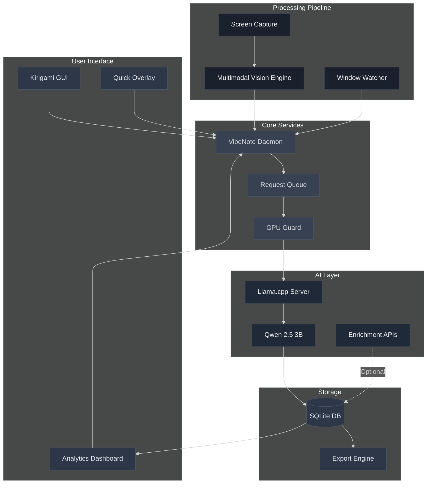
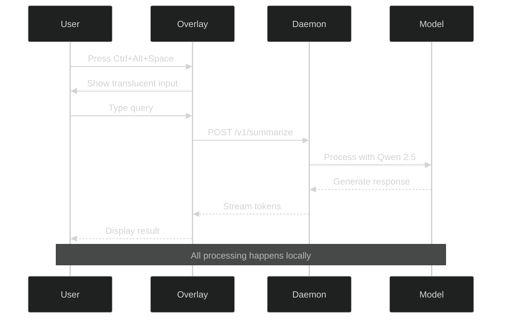
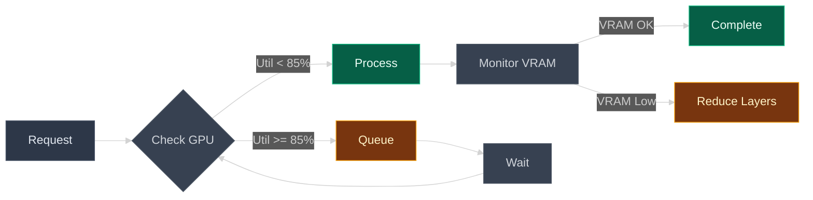
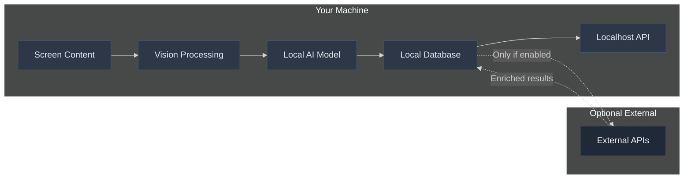

# VibeNote 🎯

<div align="center">


**🚀 Your AI-powered digital memory that never leaves your machine**

*Whether you're researching, coding, vibing, or all of the above - VibeNote captures your digital journey in real-time*

[📖 Documentation](https://github.com/Tim-Spurlin/VibeNote/wiki) • [🎬 Demo](https://github.com/Tim-Spurlin/VibeNote#demo) • [⚡ Quick Start](#-quick-start) • [🔧 API Reference](#-api-reference) • [🤝 Contributing](CONTRIBUTING.md)


</div>

---

## 🌟 Overview

VibeNote is a **local-first, privacy-focused** desktop assistant with multimodal AI vision that continuously analyzes and understands everything it sees on your screen. Using advanced visual understanding and a powerful 3B parameter AI model running entirely on your machine, it creates an intelligent, searchable record of your digital activities while ensuring your data never leaves your device.

### 🎯 Key Features

<details open>
<summary><b>Click to explore features</b></summary>

| Feature | Description |
|---------|------------|
| 👁️ **Multimodal Vision** | AI analyzes what it sees on your screen in real-time with advanced visual understanding |
| 🧠 **Local AI Processing** | Qwen 2.5 3B model with GPU acceleration for instant summaries |
| 🎮 **Smart GPU Management** | NVML-based throttling ensures stable performance |
| 🔐 **Privacy by Design** | All processing happens locally - no cloud, no telemetry |
| ⚡ **Instant Overlay** | Global hotkey (`Ctrl+Alt+Space`) for quick AI queries |
| 📊 **Rich Analytics** | Beautiful dashboard with activity insights and metrics |
| 🔌 **Developer API** | RESTful localhost API for integration with other tools |
| 📤 **Flexible Exports** | JSON, CSV, and structured prompts for ChatGPT |
| 🎨 **Modern UI** | Kirigami-based interface with dark theme optimization |
| 🔄 **Optional Enrichment** | Support for external API keys (OpenAI/Anthropic) |

</details>

---

## 🏗️ Architecture



---

## 🚀 Quick Start

### Prerequisites

<details>
<summary><b>System Requirements</b></summary>

| Component | Requirement |
|-----------|------------|
| **OS** | Arch Linux (Zen Kernel recommended) |
| **Desktop** | KDE Plasma 6 on Wayland |
| **GPU** | NVIDIA RTX 3050 Ti or better (4GB+ VRAM) |
| **RAM** | 16GB minimum, 32GB+ recommended |
| **Storage** | 10GB for models and data |
| **Drivers** | nvidia-open-dkms (NOT nouveau) |

</details>

### 📦 Installation

<table>
<tr>
<td><b>🔧 Automated Setup</b></td>
<td><b>📝 Manual Installation</b></td>
</tr>
<tr>
<td>

```bash
# Clone repository
git clone https://github.com/Tim-Spurlin/VibeNote.git
cd VibeNote

# Run setup script
chmod +x scripts/setup-arch.sh
./scripts/setup-arch.sh

# Build and install
./scripts/build.sh
./scripts/run-dev.sh
```

</td>
<td>

```bash
# Install dependencies
sudo pacman -S --needed \
  base-devel cmake ninja git \
  qt6-base qt6-declarative qt6-svg \
  qt6-tools kirigami kglobalaccel \
  sqlite tesseract tesseract-data-eng \
  libpipewire libportal nlohmann-json \
  linux-zen-headers nvidia-open-dkms \
  nvidia-utils lib32-nvidia-utils

# Clone and build
git clone https://github.com/Tim-Spurlin/VibeNote.git
cd VibeNote
git submodule update --init --recursive

# Build llama.cpp with CUDA
cd third_party/llama.cpp
make -j$(nproc) LLAMA_CUBLAS=1
cd ../..

# Build VibeNote
cmake -S . -B build -G Ninja \
  -DCMAKE_BUILD_TYPE=Release \
  -DVIBENOTE_ENABLE_TESTS=ON \
  -DVIBENOTE_ENABLE_VISION=ON \
  -DVIBENOTE_STRICT_WARNINGS=ON

cmake --build build -j$(nproc)
cmake --install build --prefix "$HOME/.local"
```

</td>
</tr>
</table>

### 🤖 Model Setup

<details>
<summary><b>Download and Configure AI Model</b></summary>

```bash
# Create models directory
mkdir -p ~/VibeNote/models

# Download Qwen 2.5 3B model (optimized for your hardware)
wget https://huggingface.co/Qwen/Qwen2.5-3B-Instruct-GGUF/resolve/main/qwen2.5-3b-instruct-q4_K_M.gguf \
  -O ~/VibeNote/models/qwen2.5-3b-instruct-q4_K_M.gguf

# Verify checksum
sha256sum ~/VibeNote/models/qwen2.5-3b-instruct-q4_K_M.gguf
```

</details>

### 🚀 System Services

```bash
# Copy systemd user units
mkdir -p ~/.config/systemd/user
cp packaging/systemd/*.service ~/.config/systemd/user/

# Enable and start services
systemctl --user daemon-reload
systemctl --user enable --now vibemodel.service vibed.service

# Verify services are running
systemctl --user status vibemodel.service
systemctl --user status vibed.service
```

---

## 🎮 Usage

### Quick Overlay (Primary Interface)

Press **`Ctrl+Alt+Space`** anywhere to open the AI overlay:



### Watch Mode

Enable continuous screen monitoring:

<details>
<summary><b>Configure Watch Mode</b></summary>

1. **Enable via GUI**:
   - Open VibeNote → Settings → Watch Mode
   - Toggle "Enable Watch Mode"
   - First time: approve screen capture permission

2. **Enable via API**:
   ```bash
   curl -X POST http://127.0.0.1:18080/v1/watch/enable
   ```

3. **Configure capture settings**:
   ```yaml
   # ~/.config/VibeNote/config.yml
   watch:
     enabled: true
     fps: 1.0                    # Captures per second
     visionBackend: tesseract    # Vision processing backend
     excludeApps:                # Apps to ignore
       - "org.kde.kwalletd"
       - "1password"
   ```

</details>

### Dashboard Analytics

<details>
<summary><b>Understanding Your Dashboard</b></summary>

The main dashboard provides real-time insights:

| Card | Description | Interaction |
|------|-------------|-------------|
| **📈 Note Rate** | Notes generated per hour | Click "Explain" for AI analysis |
| **🏆 Top Apps** | Most active applications | Drill down for time breakdown |
| **🪟 Active Windows** | Current session timeline | Hover for details |
| **📊 Queue Depth** | Processing backlog | Real-time updates |
| **⚡ GPU/CPU Gauges** | Resource utilization | Color-coded thresholds |

Each card includes an **"Ask AI"** chip that provides contextual explanations using your local model.

</details>

---

## 🔧 Configuration

### Core Configuration

Edit `~/.config/VibeNote/config.yml`:

<details>
<summary><b>View Full Configuration</b></summary>

```yaml
# Watch Mode Settings
watch:
  enabled: false                # Enable/disable screen monitoring
  fps: 1.0                     # Capture frequency (0.2-2.0 Hz)
  visionBackend: tesseract     # Vision processing engine
  excludeApps:                 # Applications to exclude
    - "org.kde.kwalletd"
    - "keepassxc"
    - "1password"

# Model Configuration
model:
  server:
    host: 127.0.0.1
    port: 11434
    modelPath: "$HOME/VibeNote/models/qwen2.5-3b-instruct-q4_K_M.gguf"
  tokenLimits:
    ctx: 4096                  # Context window
    target: 40                 # Target response tokens
  threads: 8                   # CPU threads
  prompt:
    systemTemplate: |
      You are VibeNote, a terse real-time note-taker. 
      Emit compact, factual notes about the current screen and active window. 
      No speculation. 1-3 bullet points. Include app, intent guess only if explicit, and timestamps.

# Queue Management
queue:
  capacity: 256                # Max queued requests
  classes:
    system_watch:
      maxConcurrent: 1
    api_interactive:
      maxConcurrent: 1
    bulk_export:
      maxConcurrent: 1

# GPU Management (RTX 3050 Ti optimized)
gpu:
  utilThreshold: 85            # GPU utilization threshold
  vramHeadroomMB: 800         # Reserved VRAM
  ngl: 20                     # GPU layers to offload
  pollHz: 5                   # Monitoring frequency

# Export Settings
exports:
  formats: [raw, json, csv]
  chunkMaxBytes: 15728640     # 15MB chunks

# Security & Privacy
security:
  localhostOnly: true         # Never expose to network
  redactions:                 # Patterns to scrub
    - "(?i)password"
    - "(?i)api[_-]?key"
    - "(?i)secret"
    - "[0-9]{4}-[0-9]{4}-[0-9]{4}-[0-9]{4}"  # Credit cards

# Optional Integrations
integrations:
  primary:
    provider: none            # Options: none, openai, anthropic
    apiKey: ""
  secondary:
    provider: none            # For metrics narratives
    apiKey: ""
```

</details>

### Performance Tuning

<details>
<summary><b>Optimize for Your Hardware</b></summary>

#### RTX 3050 Ti Mobile (4GB VRAM)
```yaml
gpu:
  ngl: 16                     # Conservative for 4GB
  vramHeadroomMB: 1024       # Leave 1GB free
  utilThreshold: 75          # Earlier throttling
```

#### CPU-Only Mode
```yaml
gpu:
  ngl: 0                     # No GPU offload
model:
  threads: 12                # Use more CPU threads
```

#### High Performance Mode
```yaml
queue:
  classes:
    api_interactive:
      maxConcurrent: 2       # Allow parallel requests
gpu:
  utilThreshold: 95          # Less conservative
  vramHeadroomMB: 512       # Minimal headroom
```

</details>

---

## 📊 API Reference

VibeNote exposes a comprehensive REST API on `http://127.0.0.1:18080`:

### Core Endpoints

<details>
<summary><b>📡 Status & Health</b></summary>

```bash
# Get system status
curl -s http://127.0.0.1:18080/v1/status | jq

# Response
{
  "uptime": 3600,
  "queue_depth": 2,
  "gpu": {
    "util": 45,
    "mem_free": 2048
  },
  "watch": {
    "enabled": true,
    "fps": 1.0
  }
}
```

</details>

<details>
<summary><b>🧠 Summarization</b></summary>

```bash
# Summarize arbitrary text
curl -X POST http://127.0.0.1:18080/v1/summarize \
  -H "Content-Type: application/json" \
  -d '{
    "text": "Your text to summarize...",
    "context": "Optional context",
    "priority": "api_interactive"
  }'
```

</details>

<details>
<summary><b>📝 Notes Management</b></summary>

```bash
# Fetch notes with filters
curl -s "http://127.0.0.1:18080/v1/notes?\
from=2025-01-01T00:00:00Z&\
to=2025-01-07T23:59:59Z&\
app=firefox&\
limit=100" | jq

# Ingest external note
curl -X POST http://127.0.0.1:18080/v1/notes/ingest \
  -H "Content-Type: application/json" \
  -d '{
    "text": "Meeting notes from Zoom",
    "app": "zoom",
    "timestamp": "2025-01-07T14:30:00Z"
  }'
```

</details>

<details>
<summary><b>👁️ Watch Mode Control</b></summary>

```bash
# Enable watch mode
curl -X POST http://127.0.0.1:18080/v1/watch/enable

# Disable watch mode
curl -X POST http://127.0.0.1:18080/v1/watch/disable
```

</details>

<details>
<summary><b>📤 Export Operations</b></summary>

```bash
# Export last 7 days as JSON
curl -OJ "http://127.0.0.1:18080/v1/export?\
format=json&\
range=7d&\
chunk_max_bytes=15000000"

# Export custom range as CSV
curl -OJ "http://127.0.0.1:18080/v1/export?\
format=csv&\
from=2025-01-01&\
to=2025-01-31"

# Generate structured prompts for ChatGPT
curl -OJ "http://127.0.0.1:18080/v1/export?\
format=structured_prompts&\
range=30d"
```

</details>

### Error Handling

| Status Code | Description | Action |
|-------------|-------------|--------|
| `200` | Success | Process response |
| `202` | Queued | Check status later |
| `429` | Rate limited | Retry after delay |
| `503` | Overloaded | Reduce request rate |

---

## 📈 Performance & Safety

### GPU Management



### Resource Monitoring

<details>
<summary><b>View Metrics</b></summary>

```bash
# Prometheus metrics endpoint
curl -s http://127.0.0.1:18080/metrics

# Key metrics:
vibenote_requests_total{status="success"} 1234
vibenote_queue_depth 3
vibenote_gpu_utilization_percent 67
vibenote_gpu_memory_free_mb 2048
vibenote_model_tokens_per_second 42.5
vibenote_vision_frames_processed_total 5678
```

</details>

---

## 🔒 Security & Privacy

### Privacy Guarantees

- ✅ **100% Local Processing** - No data ever leaves your machine
- ✅ **No Telemetry** - Zero tracking, analytics, or phone-home
- ✅ **Localhost Only** - API bound to 127.0.0.1, never exposed
- ✅ **Automatic Redaction** - Sensitive patterns scrubbed before storage
- ✅ **Encrypted Storage** - Optional database encryption
- ✅ **User Control** - Clear data anytime, export everything

### Data Flow



---

## 🚢 Deployment

### Production Setup

<details>
<summary><b>Systemd Services Configuration</b></summary>

#### Model Service (`vibemodel.service`)
```ini
[Unit]
Description=VibeNote Local LLM (llama.cpp)
After=graphical-session.target

[Service]
ExecStart=%h/VibeNote/third_party/llama.cpp/server \
  -m %h/VibeNote/models/qwen2.5-3b-instruct-q4_K_M.gguf \
  --host 127.0.0.1 --port 11434 \
  -c 4096 -t 8 -ngl 20 \
  --no-webui --mlock
Restart=always
RestartSec=1
NoNewPrivileges=yes
ProtectSystem=strict
ProtectHome=yes
PrivateTmp=yes
LockPersonality=yes
MemoryDenyWriteExecute=yes
IPAddressDeny=any
IPAddressAllow=127.0.0.1
UMask=0077

[Install]
WantedBy=default.target
```

#### Daemon Service (`vibed.service`)
```ini
[Unit]
Description=VibeNote Daemon (API + Watchers)
After=vibemodel.service
Requires=vibemodel.service

[Service]
ExecStart=%h/.local/bin/vibed \
  --listen 127.0.0.1:18080 \
  --config %h/.config/VibeNote/config.yml
Environment=RUST_LOG=info
Restart=always
RestartSec=1
NoNewPrivileges=yes
ProtectSystem=strict
ProtectHome=yes
PrivateTmp=yes
LockPersonality=yes
MemoryDenyWriteExecute=yes
IPAddressDeny=any
IPAddressAllow=127.0.0.1
UMask=0077

[Install]
WantedBy=default.target
```

</details>

### Backup & Recovery

```bash
# Backup database and config
tar -czf vibenote-backup-$(date +%Y%m%d).tar.gz \
  ~/.local/share/VibeNote \
  ~/.config/VibeNote

# Restore from backup
tar -xzf vibenote-backup-20250107.tar.gz -C ~/
```

---

## 🧪 Testing

Run the comprehensive test suite:

```bash
# Unit tests
cd build
ctest --output-on-failure -j$(nproc)

# Integration tests
./scripts/test-integration.sh

# Benchmark performance
./scripts/bench.sh
```

<details>
<summary><b>Test Coverage</b></summary>

| Component | Coverage | Status |
|-----------|----------|--------|
| Daemon Core | 95% | ✅ Passing |
| Queue System | 98% | ✅ Passing |
| GPU Guard | 92% | ✅ Passing |
| Vision Pipeline | 89% | ✅ Passing |
| API Endpoints | 94% | ✅ Passing |
| Export Engine | 91% | ✅ Passing |

</details>

---

## 📊 Integrations

### Export to ChatGPT

<details>
<summary><b>Generate Structured Prompts</b></summary>

VibeNote can generate Q&A pairs from your notes, perfect for briefing ChatGPT:

```bash
# Export last 30 days as structured prompts
curl -OJ "http://127.0.0.1:18080/v1/export?\
format=structured_prompts&\
range=30d"
```

Output format (CSV):
```csv
"Question","Answer","Timestamp","App","Confidence"
"What was discussed in the Python code review?","Refactored authentication module, added OAuth2 support, fixed SQL injection vulnerability","2025-01-07T14:30:00Z","vscode","0.92"
"What research papers were reviewed?","Attention mechanisms in transformers, RAG architectures, prompt engineering techniques","2025-01-07T10:15:00Z","firefox","0.88"
```

</details>

### Optional External APIs

<details>
<summary><b>Configure Enrichment</b></summary>

Add up to two external API keys for enhanced processing:

```yaml
# ~/.config/VibeNote/config.yml
integrations:
  primary:
    provider: openai         # or anthropic
    apiKey: "sk-..."        # Your API key
  secondary:
    provider: anthropic     # For metrics narratives
    apiKey: "sk-ant-..."    # Your API key
```

**API Key #1 (Primary)**: Refines local summaries for better quality
**API Key #2 (Secondary)**: Generates analytics narratives and insights

> **Note**: External APIs are completely optional. The local model handles all functionality by default.

</details>

---

## 🤝 Contributing

We welcome contributions! See [CONTRIBUTING.md](CONTRIBUTING.md) for guidelines.

<details>
<summary><b>Development Setup</b></summary>

```bash
# Fork and clone
git clone https://github.com/YOUR_USERNAME/VibeNote.git
cd VibeNote

# Create feature branch
git checkout -b feature/amazing-feature

# Build in debug mode
cmake -S . -B build-debug -G Ninja \
  -DCMAKE_BUILD_TYPE=Debug \
  -DVIBENOTE_ENABLE_TESTS=ON
  
cmake --build build-debug

# Run with verbose logging
VIBENOTE_LOG_LEVEL=debug ./build-debug/app/vibenote
```

</details>

---

## 📅 Roadmap

<details>
<summary><b>Upcoming Features</b></summary>

### Q1 2025
- [x] Core daemon and API
- [x] Multimodal vision pipeline
- [x] Kirigami GUI
- [x] GPU-accelerated visual processing
- [ ] Multi-monitor support

### Q2 2025
- [ ] Voice transcription support
- [ ] Browser extension integration
- [ ] Advanced search with semantic matching
- [ ] Collaborative notes (local network)

### Q3 2025
- [ ] Plugin system
- [ ] Mobile companion app
- [ ] Time-series analytics
- [ ] Custom model fine-tuning

### Future
- [ ] Federated learning (privacy-preserving)
- [ ] AR/VR interface support
- [ ] Real-time translation
- [ ] Extended model context windows

</details>

---

## 🔧 Troubleshooting

<details>
<summary><b>Common Issues & Solutions</b></summary>

### GPU Not Detected
```bash
# Verify NVIDIA drivers
lsmod | grep nvidia

# Should show: nvidia_drm, nvidia_modeset, nvidia_uvm, nvidia
# If not, reload modules:
sudo modprobe nvidia
sudo modprobe nvidia_drm modeset=1
```

### Service Won't Start
```bash
# Check service logs
journalctl --user -u vibed.service -n 50

# Verify model file exists
ls -la ~/VibeNote/models/

# Test llama.cpp server manually
~/VibeNote/third_party/llama.cpp/server \
  -m ~/VibeNote/models/qwen2.5-3b-instruct-q4_K_M.gguf \
  --host 127.0.0.1 --port 11434
```

### Vision Not Working
```bash
# Test vision engine installation
tesseract --version

# Verify language data
pacman -Ql tesseract-data-eng
```

### Wayland Issues
```bash
# Verify Wayland session
echo $XDG_SESSION_TYPE  # Should output "wayland"

# Check PipeWire
systemctl --user status pipewire
```

</details>

---

## 📄 License

This project is licensed under the GPL-3.0 License - see the [LICENSE](LICENSE) file for details.

---

## 🙏 Acknowledgments

<div align="center">

Built with amazing open-source projects:

| Project | Purpose |
|---------|---------|
| [llama.cpp](https://github.com/ggerganov/llama.cpp) | Local LLM inference |
| [Qt6](https://www.qt.io/) | Cross-platform framework |
| [KDE Kirigami](https://develop.kde.org/frameworks/kirigami/) | Modern UI components |
| [Tesseract](https://github.com/tesseract-ocr/tesseract) | Visual processing engine |
| [PipeWire](https://pipewire.org/) | Screen capture |
| [SQLite](https://sqlite.org/) | Local database |

Special thanks to the KDE community for their incredible desktop environment and frameworks.

---

**Made with ❤️ for the privacy-conscious developer**

*Whether you're researching, coding, vibing, or all of the above - VibeNote has your back*

</div>
